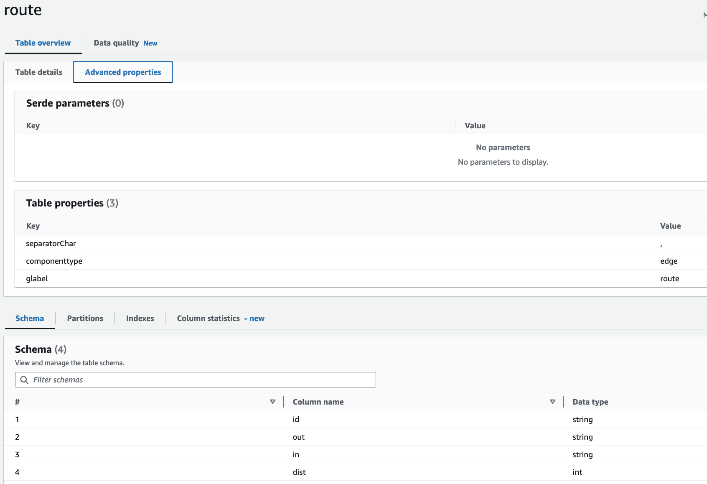
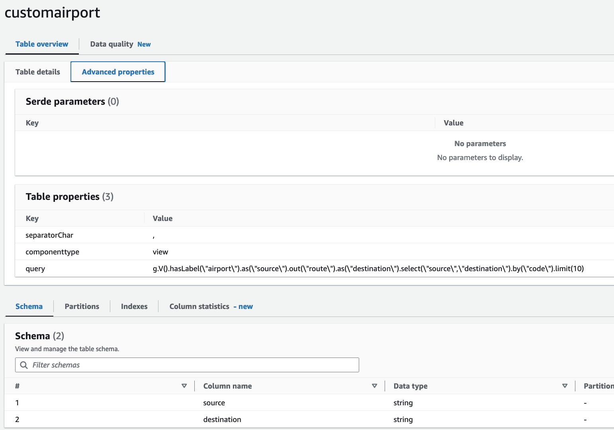

# Property Graph Glue Data Catalog Setup

To query property graph data using this connector, create a table in the Glue data catalog that maps to property graph data in the Neptune database. There are three styles of mapping available:

- *Vertex-based*: The table represents a vertex with a specified label in the graph. Each row represents a specific vertex. Its columns include the vertex ID and vertex property values. Examples tables include `airport`, `country`, and `continent` tables.
- *Edge-based*: The table represents an edge with a specified label in the graph. Each row represents a specific edge. Its column include the edge ID, source and target vertex IDs, and edge property values. An example is the `route` table.
- *Query-based*: The table represents the resultset of a Gremlin query. Each row is one result. An example is the `customairport` table.

Columns are named the same as their properties. Reserved column names are:
- `id`: vertex ID if `componenttype` is 'vertex`. edge ID if `componenttype` is 'edge`.
- `out`: If `componenttype` is edge, this is the vertex ID of the *from* vertex.
- `in`: If `componenttype` is edge, this is the vertex ID of the *to* vertex.

Advanced properties for the table are:

|Property|Values|Description|
|--------|------|-----------|
|componenttype|`vertex`, `edge`, or `view`||
|glabel|vertex label or edge type. If not specified, this is assumed to be the table name||
|query|Gremlin query if `componenttype` is `view`|

## Examples

The next screenshot shows columns and advanced properties for the sample `airport` table that maps to airport vertices in Neptune. It is a vertex table, indicated the `componenttype` of `vertex`. Its columns include `id` (the airport vertex ID) plus `type`, `code`, `icao`, and `desc` (vertex properties).


Here is an edge table for `route`. Columns include built-in `id`, `out`, and `in`. The `dist` column maps to an edge property of the `route` edge.



Finally, here is a table that presents a custom view. Notice `componentype` is `view`. 



The `query` property is 
```
g.V().hasLabel("airport").as("source").out("route").as("destination").select("source","destination").by("code").limit(10)
```

Columns are `source` and `destination`, which are the values returned by the Gremlin query above.

Run SQL queries against the Athena service to retrieve this property graph data. 

The following query retrieves 100 airports.

```
select * from "graph-database"."airport"
LIMIT 100
```

The following query retrieves 100 routes.

```
select * from "graph-database"."route"
LIMIT 100
```

The following query uses the custom view to get source-destination routes:

```
select * from "graph-database"."customairport"
LIMIT 100
```
