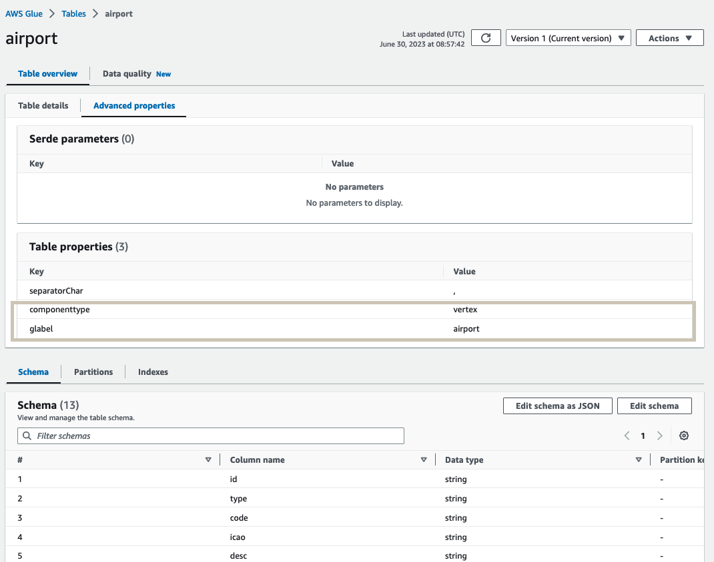
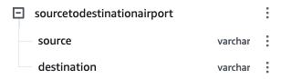
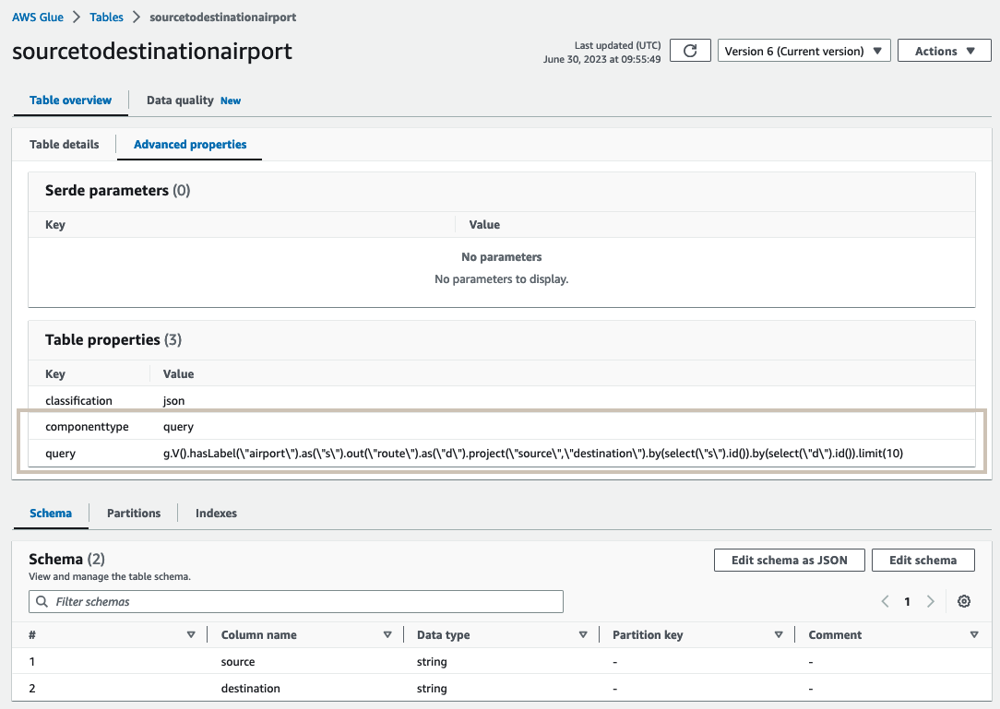

# Property Graph Glue Data Catalog Setup

Column types for tables representing Property Graph nodes or edges map from node or edge property tables. As an example, if we have a node labelled “country” with properties “type”, “code” and “desc”.  In the Glue database, we will create a table named “country” with columns “type”, “code” and “desc”. Setup data types of the columns based on their data types in the property graph. 

Refer to the diagram below:


## Create AWS Glue Catalog Database and Tables

AWS Glue Catalog Database and Tables can be created either by using [Amazon Neptune Export Configuration](#create-aws-glue-database-and-tables-using-amazon-neptune-export-configuration) or [Manually](#create-aws-glue-database-and-tables-manually). 

### Create AWS Glue Database and Tables using Amazon Neptune Export Configuration

You can use the sample node.js script [here](./automation/script.js) to create a Glue Database by the name "graph-database" and tables: airport, country, continent and route corresponding to the Air Routes Property Graph sample dataset. The node.js script uses the Amazon Neptune export configuration file. There is a sample export configuration for the Air Routes sample dataset in the [folder](./automation).

From inside the [folder](./automation), run these commands

Install dependencies

```
npm install
```

Make sure you have access to your AWS environment via CLI and Execute the script

```
node script.js

```
If you are using a different dataset make sure to replace the config.json with export output from your database. Refer [this](https://github.com/awslabs/amazon-neptune-tools/tree/master/neptune-export) for how to export configuration from Amazon Neptune database.  You have to download the source code and build it. Once you have built the neptune-export jar file, run the below command from machine where your Amazon Neptune cluster is accessible, to generated export configuration

```
bin/neptune-export.sh create-pg-config -e <neptuneclusterendpoint> -d <outputfolderpath>

```

### Create AWS Glue Database and Tables manually


If you want to create database and tables manually, you can use the sample shell script [here](./manual/sample-cli-script.sh) to create a Glue Database by the name "graph-database" and tables: airport, country, continent and route  corresponding to the Air Routes Property Graph sample dataset. 

If you're planning to use your own data set instead of the Air Routes sample dataset, then you need to modify the script according to your data structure. 

Ensure to have the right executable permissions on the script once you download it.

```
chmod 755 sample-cli-script.sh
```
Ensure to setup credentials for your AWS CLI to work.

Replace &lt;aws-profile> with the AWS profile name that carries your credentials and replace &lt;aws-region> with AWS region where you are creating the AWS Glue tables which should be the same as your Neptune Cluster's AWS region.

```
./sample-cli-script.sh  <aws-profile> <aws-region>
```


If all goes well you now have the Glue Database and Tables that are required for your Athena Neptune Connector setup and you can move on to those steps mentioned [here](../neptune-connector-setup/).

### Sample table post setup



### Query examples

##### Graph Query

```
g.V().hasLabel("airport").as("source").out("route").as("destination").select("source","destination").by(id()).limit(10)
```

#####  Equivalent Athena Query
```
SELECT 
a.id as "source",b.id as "destination" FROM "graph-database"."airport" as a 
inner join "graph-database"."route" as b 
on a.id = b.out
inner join "graph-database"."airport" as c 
on c.id = b."in"
limit 10;
```

## Custom query

Neptune connector custom query feature allows you to specify a custom Glue table, which matches response of a Gremlin Query. For example a gremlin query like 

```
g.V().hasLabel("airport").as("source").out("route").as("destination").select("source","destination").by(id()).limit(10)

```

matches to a Glue table 



Refer example scripts on how to create a table [here](./manual/sample-cli-script.sh)

> **NOTE**
>
> Custom query feature allows simple type (example int,long,string,dateime) projections as query output


### Example query patterns 

##### project node properties

```
g.V().hasLabel("airport").valueMap("code","city","country").limit(10000)
```

##### project edge properties

```
g.E().hasLabel("route").valueMap("dist").limit(10000)
```

##### n hop query with select clause

```
g.V().hasLabel("airport").as("source").out("route").as("destination").select("source","destination").by("code").limit(10)

```

##### n hop query with project clause
```
g.V().hasLabel("airport").as("s").out("route").as("d").project("source","destination").by(select("s").id()).by(select("d").id()).limit(10)

```

### Sample table post setup



###  Benefits

Using custom query feature you can project output of a gremlin query directly. This helps to avoid the effort to write a lengthly sql query on the graph model. It also allows more control on how the table schema should be designed for analysis purpose. You can limit the number of records to retrieve in the gremlin query itself.


