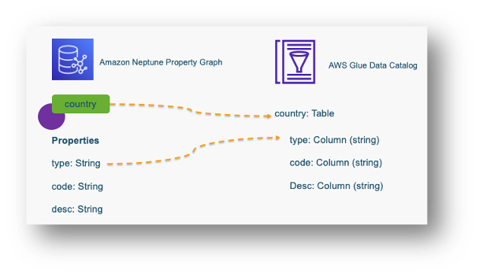

# Property Graph Glue Data Catalog Setup

To query property graph data using this connector, create a table in the Glue data catalog that maps to property graph data in the Neptune database. There are three styles of mapping available:

- Vertex-based: The table represents a vertex with a specified label in the graph. Each row represents a specific vertex. Its column include the vertex ID and vertex property values. Examples include `airport`, `country`, and `continent` tables.
- Edge-based: The table represents an edge with a specified label in the graph. Each row represents a specific edge. Its column include the edge ID, source and target vertex IDs, and edge property values. An example is the `route` table.
- Query-based: The table represents the resultset of a Gremlin query. Each row is one result. An example is the `customairport` table.

Column types for tables representing Property Graph nodes or edges map from node or edge property tables. As an example, if we have a node labelled “country” with properties “type”, “code” and “desc”.  In the Glue database, we will create a table named “country” with columns “type”, “code” and “desc”. Setup data types of the columns based on their data types in the property graph. 

Refer to the diagram below:



### Sample table post setup


### Query examples

##### Graph Query

```
g.V().hasLabel("airport").as("source").out("route").as("destination").select("source","destination").by(id()).limit(10)
```

#####  Equivalent Athena Query
```
SELECT 
a.id as "source",b.id as "destination" FROM "graph-database"."airport" as a 
inner join "graph-database"."route" as b 
on a.id = b.out
inner join "graph-database"."airport" as c 
on c.id = b."in"
limit 10;
```

## Custom query

Neptune connector custom query feature allows you to specify a custom Glue table, which matches response of a Gremlin Query. For example a gremlin query like 

```
g.V().hasLabel("airport").as("source").out("route").as("destination").select("source","destination").by(id()).limit(10)

```

matches to a Glue table 


Refer example scripts on how to create a table [here](./manual/sample-cli-script.sh)

> **NOTE**
>
> Custom query feature allows simple type (example int,long,string,dateime) projections as query output


### Example query patterns 

##### project node properties

```
g.V().hasLabel("airport").valueMap("code","city","country").limit(10000)
```

##### project edge properties

```
g.E().hasLabel("route").valueMap("dist").limit(10000)
```

##### n hop query with select clause

```
g.V().hasLabel("airport").as("source").out("route").as("destination").select("source","destination").by("code").limit(10)

```

##### n hop query with project clause
```
g.V().hasLabel("airport").as("s").out("route").as("d").project("source","destination").by(select("s").id()).by(select("d").id()).limit(10)

```

### Sample table post setup


###  Benefits

Using custom query feature you can project output of a gremlin query directly. This helps to avoid the effort to write a lengthly sql query on the graph model. It also allows more control on how the table schema should be designed for analysis purpose. You can limit the number of records to retrieve in the gremlin query itself.


