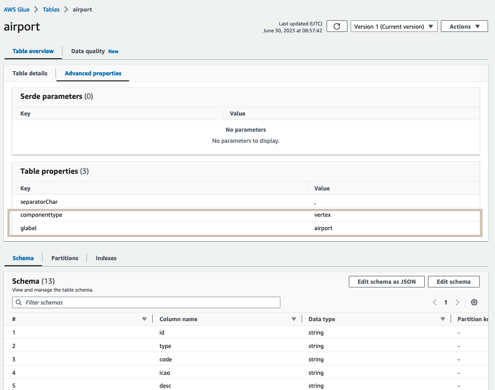
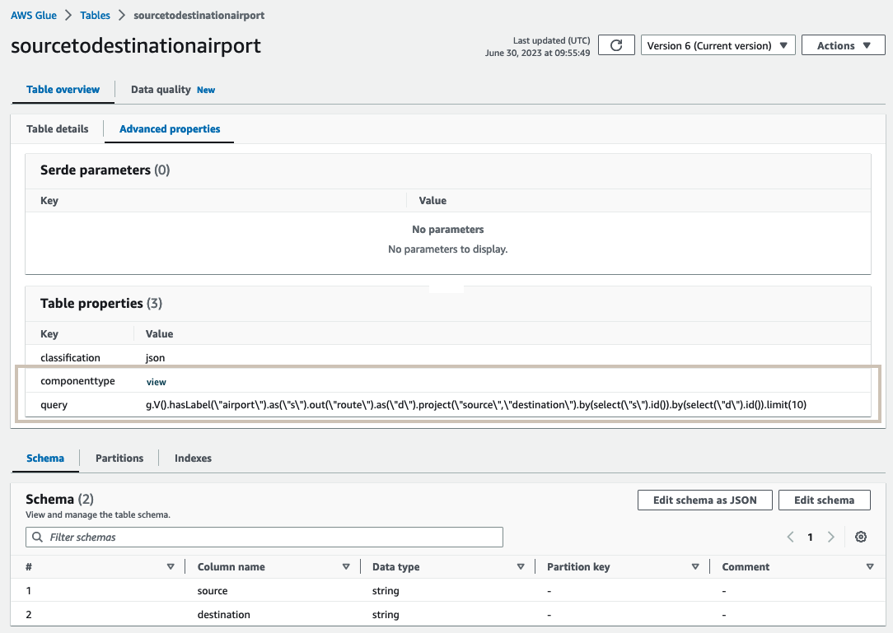

# Setup AWS Glue Catalog


Each table within the AWS Glue Catalog based database maps to:

- One node/vertex or edge/relationship type within your Amazon Neptune Property Graph model
- One resource or one SPARQL query result within your Amazon Neptune RDF model

We support the following datatypes for table columns:
        
|Glue DataType|Apache Arrow Type|
|-------------|-----------------|
|int|INT|
|bigint|BIGINT|
|double|FLOAT8|
|float|FLOAT4|
|boolean|BIT|
|binary|VARBINARY|
|string|VARCHAR|
|timestamp|DATEMILLI|

<br/>

For more on creating tables for property graph data, see [PropertyGraph.md](PropertyGraph.md).

For more on creating tables for RDF data, see [RDF.md](RDF.md).


### Sample table post setup



### Query examples

##### Graph Query

```
g.V().hasLabel("airport").as("source").out("route").as("destination").select("source","destination").by(id()).limit(10)
```

#####  Equivalent Athena Query
```
SELECT 
a.id as "source",b.id as "destination" FROM "graph-database"."airport" as a 
inner join "graph-database"."route" as b 
on a.id = b.out
inner join "graph-database"."airport" as c 
on c.id = b."in"
limit 10;
```

## Custom query

Neptune connector custom query feature allows you to specify a custom Glue table, which matches response of a Gremlin Query. For example a gremlin query like 

```
g.V().hasLabel("airport").as("source").out("route").as("destination").select("source","destination").by(id()).limit(10)

```

matches to a Glue table 


Refer example scripts on how to create a table [here](./manual/sample-cli-script.sh)

> **NOTE**
>
> Custom query feature allows simple type (example int,long,string,dateime) projections as query output


### Example query patterns 

##### project node properties

```
g.V().hasLabel("airport").valueMap("code","city","country").limit(10000)
```

##### project edge properties

```
g.E().hasLabel("route").valueMap("dist").limit(10000)
```

##### n hop query with select clause

```
g.V().hasLabel("airport").as("source").out("route").as("destination").select("source","destination").by("code").limit(10)

```

##### n hop query with project clause
```
g.V().hasLabel("airport").as("s").out("route").as("d").project("source","destination").by(select("s").id()).by(select("d").id()).limit(10)

```

### Sample table post setup



###  Benefits

Using custom query feature you can project output of a gremlin query directly. This helps to avoid the effort to write a lengthly sql query on the graph model. It also allows more control on how the table schema should be designed for analysis purpose. You can limit the number of records to retrieve in the gremlin query itself.


