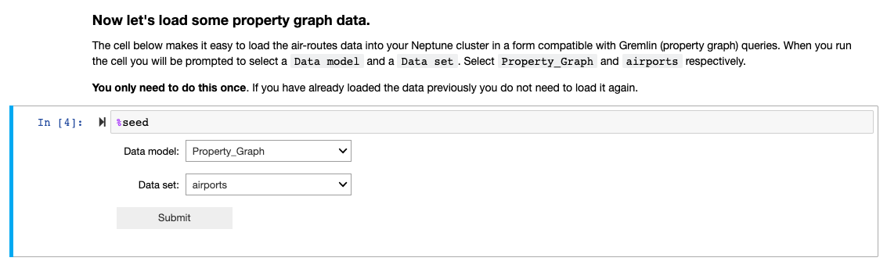

# Sample Neptune Cluster Setup
You can skip this step if you’ve an existing Amazon Neptune cluster and property graph dataset in it that you would like to use. Ensure to have an Internet Gateway and NAT Gateway in the VPC hosting your Neptune cluster and the private subnets in which the Amazon Athena Neptune Connector Lambda function will be running should have route to the internet via this NAT Gateway. This NAT Gateway will be later on used by the Amazon Athena Neptune Connector Lambda function to talk to AWS Glue.

To create a Neptune cluster, we’re going to use the CloudFormation template available in the Neptune documentation available [here](https://docs.aws.amazon.com/neptune/latest/userguide/get-started-create-cluster.html#get-started-cfn-create). When deploying the Neptune cluster, ensure to pick an AWS region that is compatible with Amazon Athena Query Federation. Latest information on the supported AWS regions will be available in the Amazon Athena Query Federation SDK [documentation](https://github.com/awslabs/aws-athena-query-federation).

Before we get started with creating the Amazon Neptune cluster, first create an EC2 Key Pair from EC2 console. We use this key pair later on during the Neptune cluster creation using CloudFormation.

Few things to note about the Input parameters for Neptune cluster and Notebook creation CloudFormation template:
   * Change the “EC2ClientInstanceType” to a “t3.micro” 
   * Under the “EC2SSHKeyPairName”, select the EC2 key pair that you created above.
   * And for the “NotebookInstanceType”, select “ml.t3.medium”. This Notebook is later on used to seed data into the Neptune cluster.

Once after the Amazon Neptune cluster and the associated Notebook have been created, let’s load this cluster with some sample property graph data. For this post, we are going to use the “Air Routes Dataset” as an example. The air routes dataset models a large part of the world airline route network. It contains vertices (nodes) representing airports, countries and continents. Edges are used to represent the routes between the airports and the links between continents, countries and airports.

Go to, the Neptune AWS console and navigate to “Notebooks” section where we will find the Notebook that was created as part of the CloudFormation stack above. Select the Notebook and click on “Open notebook”.

Once there, launch the “Air-Routes-Gremlin.ipynb” notebook under “Neptune --> 02-Visualization”. This notebook contains the Gremlin Examples using the Air Routes dataset mentioned above.

Run through first three steps of Notebook Version, Configuration and Neptune cluster status check.

You can skip the step that says "Using a different endpoint". It's applicable only if you want to use a different Neptune endpoint.

Now let’s load some sample data into our Neptune cluster by using the “%seed” step. We will load airport data in both property graph and RDF. First select “Data model” as “Property_Graph” and “Data set” as “airports” and click “Submit”. 

You can monitor the load status from the notebook itself. Once the data load is complete, you should see the “Done” status.

Repeat the “%seed” step to load airport data in RDF form. Select “Data model” as “RDF” and “Data set” as “airports” and click “Submit”.  Wait for completion and check the status is "Done".

