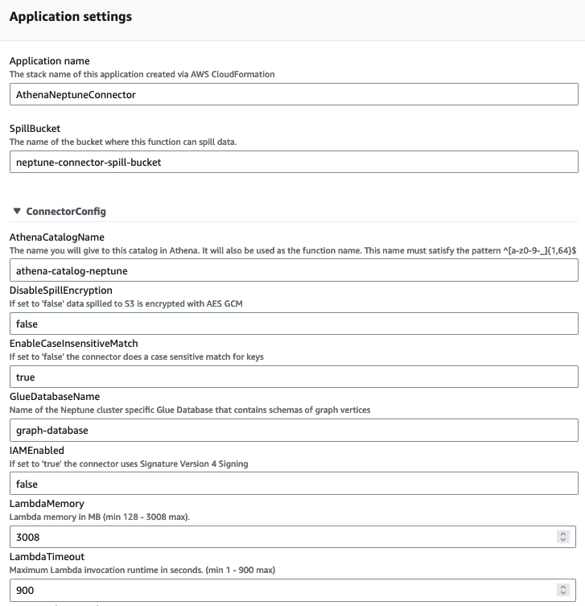
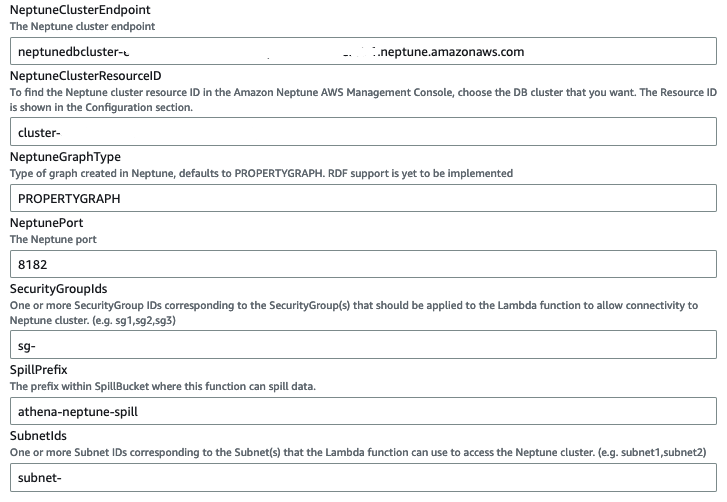

# Deploy Amazon Athena Neptune Connector

To deploy the Amazon Athena Neptune connector, we will need the following pre-requisite information:
1)	SpillBucket – You can either use an existing S3 bucket or create a new one to be used by the connector to store spill over results for Athena to consume.

2)	NeptuneClusterEndpoint – You can get this information from the Neptune console and copying the cluster “Writer” endpoint information.

3)	NeptuneClusterResourceID - To find the Neptune cluster resource ID in the Amazon Neptune AWS Management Console, choose the DB cluster that you want. The Resource ID is shown in the Configuration section.

4)	SecurityGroupIds – These are the Security Group ID(s) that the connector Lambda function uses to communicate with Neptune. There are two steps:
  * Create a Security Group to associate with the connector lambda function:
    * Go to the EC2 console --> Security Groups and then click “Create security group”
    * Provide “Name”, “Description” for the new Security Group and select the VPC where your Neptune cluster is available. For the “Inbound” and “Outbound” rules leave them as default ones and click “Create Security Group”

    * Once the Security Group is created, make a note of its ID that starts with “sg-“.
  * Update the Neptune Security group to have an inbound rule from the connector security group for the port your Neptune Database is listening on. By default, this is 8182. 
    * Go to the Neptune console, select the DB instance and click on the Security Group associated with the DB.

 
    * In the Neptune DB security group, click on the “Actions --> Edit Inbound rules”

    * In the next screen, click on “Add rule” and add an inbound rule to allow TCP traffic on Neptune port from Security Group of Neptune connector to Neptune DB Security Group and click on “Save rules”.

5)	SubnetIds: The subnet IDs in which the connector lambda function is supposed to run. We can either create new subnets within the Neptune VPC or use the subnets that are associated with Neptune DB. In this case, I’m choosing the subnets that are associated with Neptune DB to keep the process simple. 
To get the list of subnets associated with the Neptune DB, go to the Neptune console and collect subnet IDs as shown in the screenshot below:

Now that we have all the pre-requisite information to deploy the Athena Neptune Connector, let’s go to “Serverless Application Repository” in AWS Console and search for “AthenaNeptuneConnector”. Ensure to have the “Show apps that create custom IAM roles or resource policies” flag enabled while searching. Once you’re able to find the connector name, click on it.

 
Scroll down to “Application Settings” and specify the following field values:

  * Application Name: You can mention the Serverless App Name that you want. Example: AthenaNeptuneConnector

  * SpillBucket: Specify bucket name without s3 prefix. Example: neptune-connector-spill-bucket

  * AthenaCatalogName: The name you want to use for this catalog in Athena which will also be used as the connector lambda function name. Example: athena-catalog-neptune

  * DisableSpillEncryption: This option helps in disabling or enabling encryption of spilled over data in S3 bucket. Choose which ever option makes sense for your use case. Default value is “false”.

  * GlueDatabaseName: This should be same as the glue database you created in one of the earlier steps. Example: graph-database.

  * IAMEnabled: This option indicates whether you have IAM DB Auth enabled on your Neptune Cluster or not. Default value is false.

  * LambdaMemory: The memory allocation for the connector lambda function ranging between 128 – 3008 MB. The default is 3008 MB.

  * LambdaTimeout: Timeout value in seconds for the connector lambda function. Default value is 900 seconds.

  * NeptuneClusterEndpoint: Provide the Neptune Cluster endpoint that you have captured in one of the previous steps. 

  * NeptuneClusterResourceID: Provide the Neptune Cluster resourceid that you have captured in one of the previous steps.

  * NeptunePort: The listener 	port for your Neptune Cluster. Default is 8182.

  * SecurityGroupIds: Provide the connector security group ID that you’ve created earlier.

  * SpillPrefix: Object prefix that you would like to use for data spilled over into the S3 bucket.

  * SpillSSEAlgorithm: Set this to: 'aes256' if you want to turn on server side encryption for spilling.

  * SubnetIds: Subnet IDs that you have captured in one of the earlier steps separated by commas.

Provide Acknowledgement on the custom IAM roles creation and click on “Deploy”.
Sample screenshots below:

 
Wait for the deployment to be complete before proceeding with the next step. You can monitor the deployment status under the “Deployments” tab. 
