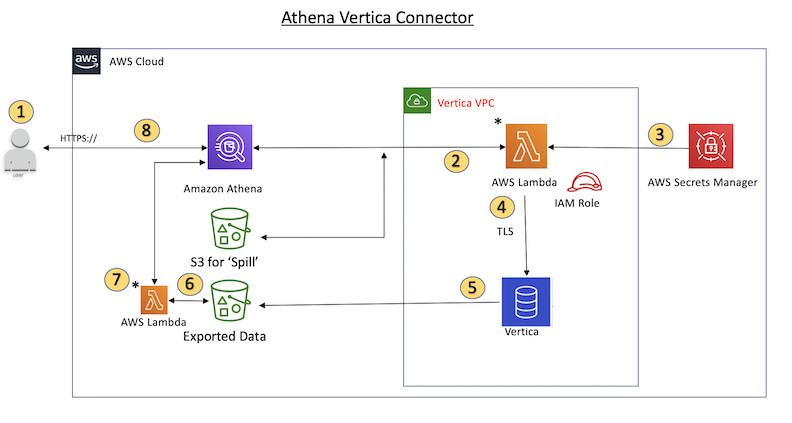

# Amazon Athena Vertica Connector

This connector enables Amazon Athena to communicate with your Vertica Database instance(s), making your Vertica data accessible via SQL.

### Design



The Amazon Athena Vertica connector for federated queries uses following design.
1. A SQL query is issued against table(s) in Vertica.
2. The connector will parse the SQL query to send the portion to Vertica through the JDBC connection to Vertica.
3. The connection strings will use the Username and Password stored in AWS Secrets Manager to gain access to Vertica
4. The connector will wrap the SQL query against Vertica with a Vertica EXPORT command like this example:
    ```
    EXPORT TO PARQUET (directory = 's3://<bucket_name/<folder_name>, Compression='Snappy', fileSizeMB=64) OVER() as 
    SELECT
    PATH_ID,
    ….
    SOURCE_ITEMIZED,
    SOURCE_OVERRIDE
    FROM DELETED_OBJECT_SCHEMA.FORM_USAGE_DATA
    WHERE PATH_ID <= 5;
    ```
5. Vertica will process the SQL query and send the result set to a an S3 bucket instead of sending the result set through the JDBC connection back to Athena, as shown in the EXPORT command above.  This will eliminate the performance problem of sending large multi-gb result sets through the JDBC connection.  Instead Vertica can utilize the EXPORT utility to parallelize the write to the S3 bucket by writing multiple parquet files using EXPORT option and achieve high bandwidth on the write to S3.
6. Athena will scan the S3 bucket to determine the number of files to read for the result set.
7. Athena will call Lambda with multiple calls to read back all the parquet files (using S3 SELECT) that comprise the result set from Vertica.  This will allow Athena to parallelize the read of the S3 files up to a maximum bandwidth up to 100GB per second.
8. Athena will process the data returned from Vertica with data scanned from the data lake and   return the result to the user.


### Parameters

The Amazon Athena Vertica Connector exposes several configuration options via Lambda environment variables. More detail on the available parameters can be found below.

* **AthenaCatalogName:** Lambda function name
* **ExportBucket:** The S3 bucket where the Vertica query results will be exported.
* **SpillBucket:** The name of the bucket where this function can spill data.
* **SpillPrefix:** The prefix within SpillBucket where this function can spill data.
* **SecurityGroupIds:** One or more SecurityGroup IDs corresponding to the SecurityGroup that should be applied to the Lambda function. (e.g. sg1, sg2, sg3)
* **SubnetIds:** One or more Subnet IDs corresponding to the Subnet that the Lambda function can use to access your data source. (e.g. subnet1, subnet2)
* **SecretNameOrPrefix:** The name or prefix of a set of names within Secrets Manager that this function should have access to. (e.g. vertica-*)
* **VerticaConnectionString:** The Vertica connection details to use by default if not catalog specific connection is defined and optionally using SecretsManager (e.g. ${secret_name}).
* **VPC ID:** The VPC Id to be attached to the Lambda function

### Terms

* **Database Instance:** Any instance of a Vertica database deployed on EC2.
* **Database type:** Vertica.
* **Handler:** A Lambda handler accessing your database instance(s). Could be metadata or a record handler.
* **Metadata Handler:** A Lambda handler that retrieves metadata from your database instance(s).
* **Record Handler:** A Lambda handler that retrieves data records from your database instance(s).
* **Composite Handler:** A Lambda handler that retrieves metadata and data records from your database instance(s). This is recommended to be set as lambda function handler. 
* **Property/Parameter:** A database property used by handlers to extract database information for connection. These are set as Lambda environment variables.
* **Connection String:** Used to establish connection to a database instance.
* **Catalog:** Athena Catalog. This is not a Glue Catalog. Must be used to prefix `connection_string` property.

### Connection String:

Connection string is used to connect to a database instance. Following format is supported:

`jdbc:vertica://<host_name>:<port>/<database>?user=<vertica-username>&password=<vertica-password>`


Amazon Athena Vertica Connector supports substitution of any string enclosed like *${SecretName}* with *username* and *password* retrieved from AWS Secrets Manager. Example: 

```
jdbc:vertica://<host_name>:<port>/<database>?user=${vertica-username}&password=${vertica-password}
```
will be modified to:

```
jdbc:vertica://<host_name>:<port>/<database>?user=sample-user&password=sample-password
```
Secret Name `vertica-username` will be used to retrieve secrets.

Currently supported databases recognize `vertica-username` and `vertica-password` JDBC properties.

### Database specific handler parameters

Database specific metadata and record handlers can also be used to connect to a database instance. These are currently capable of connecting to a single database instance.

|Handler|Class|
|---|---|
|Composite Handler|VerticaCompositeHandler|
|Metadata Handler|VerticaMetadataHandler|
|Record Handler|VerticaRecordHandler|

**Parameters:**

```
default         Default connection string. Required. This will be used when a catalog is not recognized.
```

### Spill parameters:

Lambda SDK may spill data to S3. All database instances accessed using a single Lambda spill to the same location.

```
spill_bucket    Spill bucket name. Required.
spill_prefix    Spill bucket key prefix. Required.
```

### Vertica Data types supported

|Vertica|
| ---|
|Boolean|
|BigInt|
|Short|
|Integer|
|Long|
|float|
|Double|
|Date|
|Varchar|
|Bytes|
|BigDecimal|
|TimeStamp as Varchar|

See respective database documentation for conversion between JDBC and database types.

### Secrets

We support two ways to input database user name and password:

1. **AWS Secrets Manager:** The name of the secret in AWS Secrets Manager can be embedded in JDBC connection string, which is used to replace with `vertica-username` and `vertica-password` values from AWS Secrets Manager. To use the Athena Federated Query feature with AWS Secrets Manager, the VPC connected to your Lambda function should have [internet access](https://aws.amazon.com/premiumsupport/knowledge-center/internet-access-lambda-function/) or a [VPC endpoint](https://docs.aws.amazon.com/secretsmanager/latest/userguide/vpc-endpoint-overview.html#vpc-endpoint-create) to connect to Secrets Manager.
2. **Connection String:** Username and password can be specified as properties in the JDBC connection string.

### Deploying The Connector

To use the Amazon Athena Vertica Connector in your queries build and deploy this connector from source follow the below steps:

1. From the athena-federation dir, run `mvn clean install` if you haven't already.
2. From the athena-vertica dir, run `mvn clean install`.
3. From the athena-vertica dir, run  `../tools/publish.sh S3_BUCKET_NAME athena-vertica [region]` to publish the connector to your private AWS Serverless Application Repository. The `S3_BUCKET_NAME` in the command is where a copy of the connector's code will be stored for Serverless Application Repository to retrieve it. This will allow users with permission to do so, the ability to deploy instances of the connector via 1-Click form. Then navigate to [Serverless Application Repository](https://aws.amazon.com/serverless/serverlessrepo)
4. Deploy the serverless application following the instructions [here](https://docs.aws.amazon.com/serverlessrepo/latest/devguide/serverlessrepo-how-to-consume.html)
5. Connect the serverless application with Athena following the instructions [here](https://docs.aws.amazon.com/athena/latest/ug/connect-to-a-data-source-lambda.html)

### Vertica Drivers

The POM references the Vertica drivers hosted in Maven Central repository.


### Limitations
1. The A/V connector uses S3 Select internally to read the parquet files from S3, this will cause slow performance of the connector. It is recommended to use a `CREATE TABLE AS (SELECT ..)`  and use SQL predicates when querying large tables
2. Currently, due to a bug in Athena Federated Query, the connector will cause Vertica to export ALL the columns of the queried table to S3 but only the queried columns will be visible in the results on Athena console
3. Write DDL operations are not supported
4. Any relevant AWS Lambda limits


